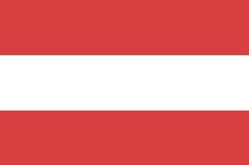

# 

# Visit Vienna

### "Visit Vienna" is a site to offer users a concise visitor's guide which includes some popular attractions, restaurants and outdoor activities. "Visit Vienna" is intended for travelers with limited times who are looking for a quick overview of activities for their visit.

## Existing Features:
- ### Navigation Bar
  - Featured on all four pages, the navigation bar is fully responsive and includes a image that brings you back to the home screen and links for all other pages: Attractions, Restaurants and Outdoors.
  - The navigation bar's structure is meant to be familiar to users: when a user visits the site, it is clear how to navigate each page.
  - To add to usability, a hover effect was added so there is feedback to the user has they choose which page to visit.

- ### Landing page image
  - The home page features a photo of the Vienna skyline at dusk with a transparent text overlay containing Vienna, Austria and a small fact about the city.

- ### Landing page video
  - The home page includes a short, embedded YouTube video showing some highlights of Vienna meant to get the user excited about visiting the city.

- ### Pages
  - Each page features a large, beautiful hero image and below there is a content section featuring three columns each containing an attraction.
  - Each content item includes a clickable title, photo and short description. 

- ### Attractions page

- ### Restaurants page

 
 - ### Outdoors page

- ### Footer
  - The footer is visually simple and contains three icons with links to social media accounts for the City of Vienna. All links open in a new tab.

## Testing
Throughout the entire process, I utilized the Chrome Developer Tools to verify the site's:
  - Responsiveness on different screen sizes and mobile devices
    - When there was unexpected behavior when shriking the screen size, I knew at which screen size I needed to add a media query.
  - Lighthouse was used to rate the site's accessibility and efficiency.

## Validator Testing
#### HTML
- No errors were returned when passing through the official W3C validator.
#### CSS
- No errors were found when passing through the official (Jigsaw) validator.

## Deployment
The site was deployed to GitHub pages. The steps to deploy are as follows:
- In the GitHub repository, navigate to the Settings tab
From the source section drop-down menu, select the Master Branch
Once the master branch has been selected, the page will be automatically refreshed with a detailed ribbon display to indicate the successful deployment.
- The live link can be found here - https://cbstange.github.io/visit-vienna/

## Credits
### Media
- Images were sourced from [Unsplash](https://unsplash.com/) which is a site that provides free images so there are no copywrite violations.
- The video on the index.html splash screen was sourced from a [Youtube](https://www.youtube.com/watch?v=nK_SLrX4Pfc) channel called "Cities of the World".

### Content
- The code for the footer socials was taken from the Code Institue ["Love Running"](https://code-institute-org.github.io/love-running-2.0/index.html) sample project.
- Fonts were sourced from [Google Fonts.](https://fonts.google.com/)
- Font and background colors were sourced from [Coolors.](https://coolors.co/)
- Descriptions for each of the recommendations on the site were inspired by [The City of Vienna's Homepage.](https://www.wien.info/de?fbclid=IwAR2pgHbrho6MsR38oeZCxlwGr5lFF47vXAEo9Y_W17FoFtc7zmHG8U5pJt4)
- Navigation bar was inspired by this [YouTube](https://www.youtube.com/watch?v=PwWHL3RyQgk&t=428s) tutorial by "Skillthrive".